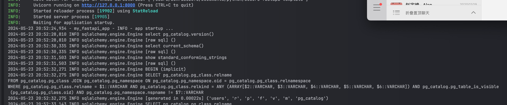

# Create database with `Azure Cloud Shell`

## 1. Define your initial settings

```bash
# Variable block
let "randomIdentifier=$RANDOM*$RANDOM"
location="East US"
resourceGroup="my-test-pgsql-db-$randomIdentifier"
tag="create-postgresql-server-and-firewall-rule"
server="my-test-pgsql-db-$randomIdentifier"
sku="GP_Gen5_2"
login="azureuser"
password="Pa$$w0rD-$randomIdentifier"
# Specify appropriate IP address values for your environment
# to limit / allow access to the PostgreSQL server
startIp=0.0.0.0
endIp=255.255.255.255
echo "Using resource group $resourceGroup with login: $login, password: $password..."

```

## 2. Set up database instance on MS Azure

Follow the following commands:
https://learn.microsoft.com/en-us/azure/postgresql/single-server/quickstart-create-server-database-azure-cli


## 3. Update local properties

    [database]
    database.dbname=postgres
    database.user=azureuser@my-test-pgsql-db-293187149
    database.password=Pa2453w0rD-293187149
    database.host=my-test-pgsql-db-293187149.postgres.database.azure.com
    database.port=5432

## 4. Update `services/pooled_db_service.py`

    from config import config
    
    host: str = config.get("database", "database.host")
    user: str = config.get("database", "database.user")
    password: str = config.get("database", "database.password")
    database: str = config.get("database", "database.dbname")
    
    DATABASE_URL = "postgresql+asyncpg://{0}:{1}@{2}:5432/{3}".format(user, password, host, database)

## 5. Run you `fatsapi` app on local

    uvicorn main:app --reload

Then you can use api endpoints on `localhost:8000`



# Create docker image of your app ang push to `Use Azure Container Registry`